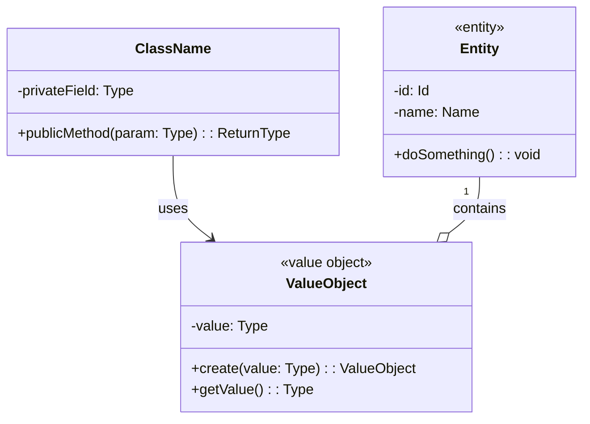

### 改善後のクラス図

以下のMermaid形式でクラス図を出力してください：

```mermaid
classDiagram
    class ClassName {
        -privateField: Type
        +publicMethod(param: Type): ReturnType
    }

    class ValueObject {
        <<value object>>
        -value: Type
        +create(value: Type): ValueObject
        +getValue(): Type
    }

    class Entity {
        <<entity>>
        -id: Id
        -name: Name
        +doSomething(): void
    }

    ClassName --> ValueObject : uses
    Entity "1" --o "*" ValueObject : contains
```

注意点：
- ドメインオブジェクトには `<<entity>>` や `<<value object>>` のステレオタイプを付与
- 依存関係は矢印で明示
- privateフィールドは `-`、publicメソッドは `+` で表記
